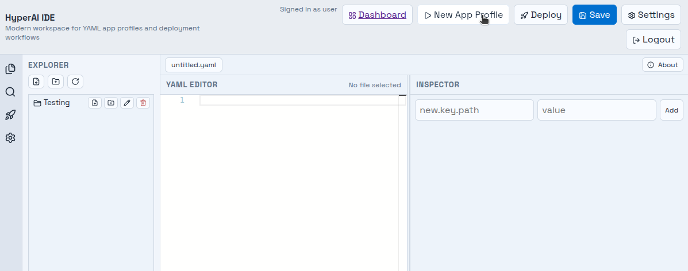
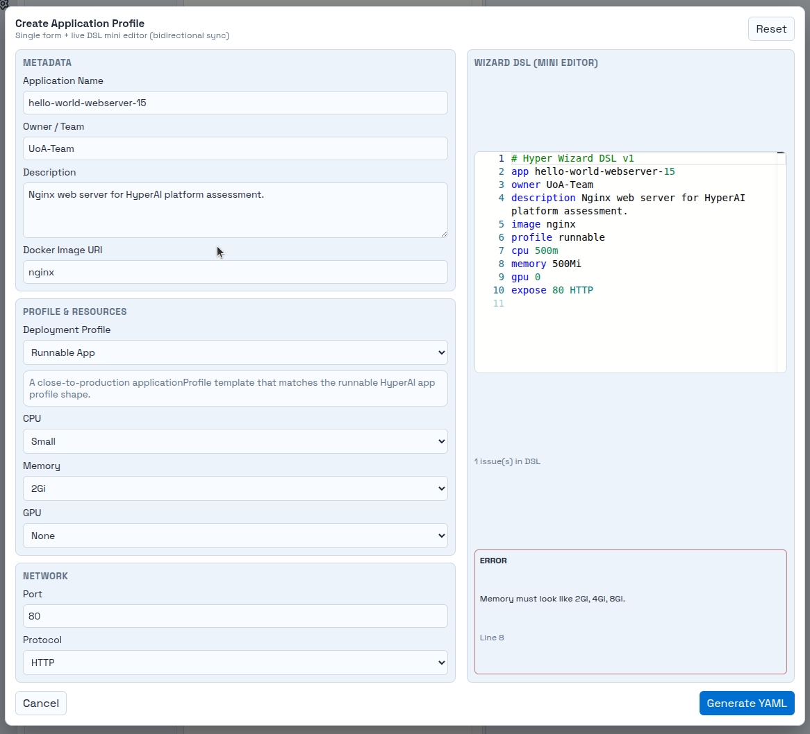
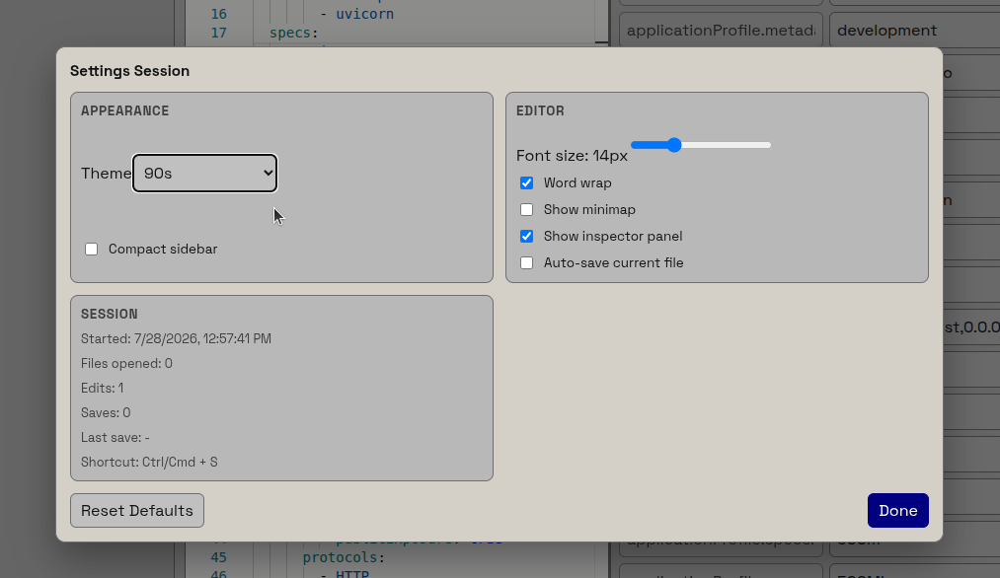

# IDE Guide

How to interact with the HyperAI IDE to build your projects.

Live: [ide.hyperai.di.uoa.gr](https://ide.hyperai.di.uoa.gr/).

## Login / Signup

Opening the IDE redirects you to the HyperAI sign-in page. Enter your email and password and click **Sign In**. New users can create an account through the **Register** link, and **Forgot Password?** starts a reset.

## Using the Wizard

The Wizard is a smart way to define your application in an easy way. Open it by clicking **New App Profile** in the top bar.

You can either fill in the form or edit the **Wizard DSL** in the mini editor — the two stay in sync, and validation errors are shown live.

When you finalize, click **Generate YAML** — the YAML is automatically sent to the main YAML editor.

## Settings

To customize the IDE, click **Settings** in the top bar. From there you can change the theme, the font size, and many more — or reset everything back to the defaults with **Reset Defaults**.

