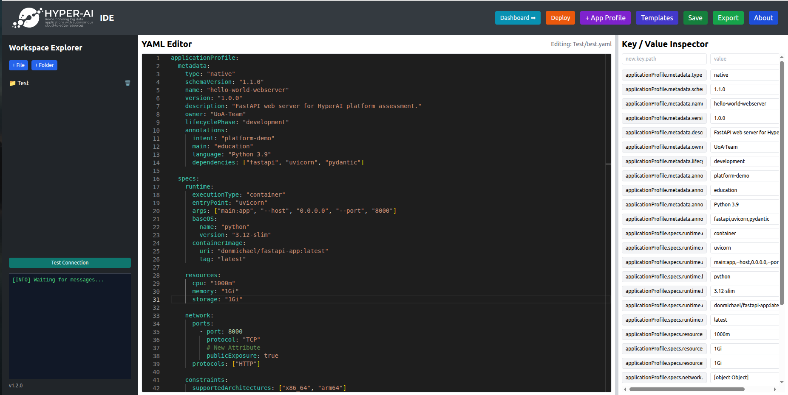
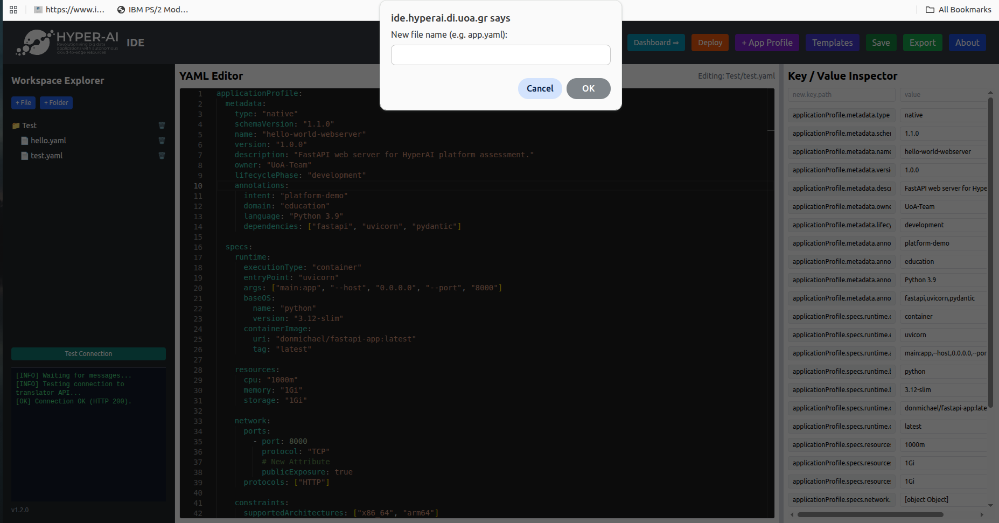
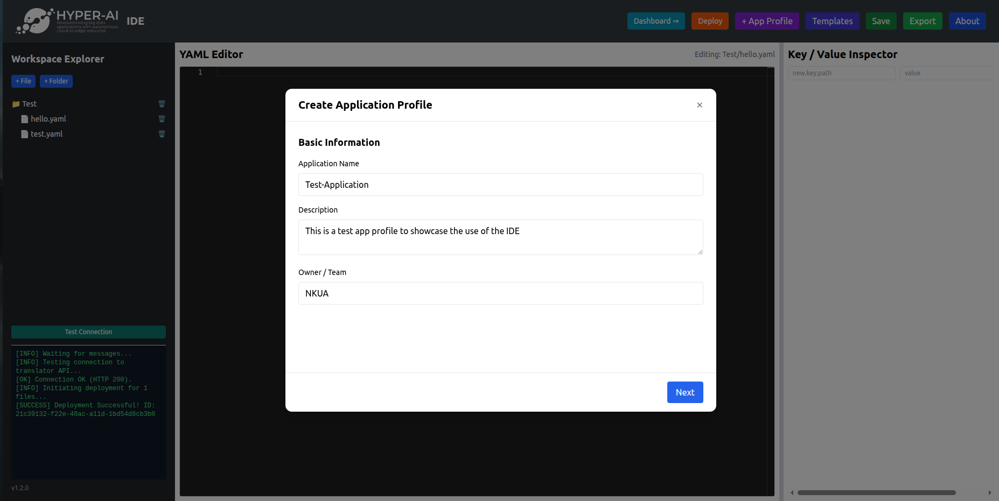
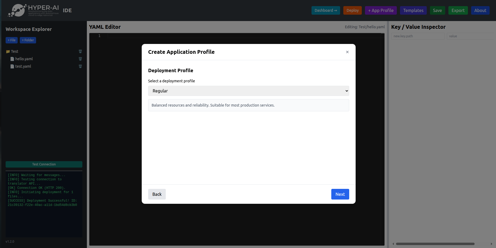
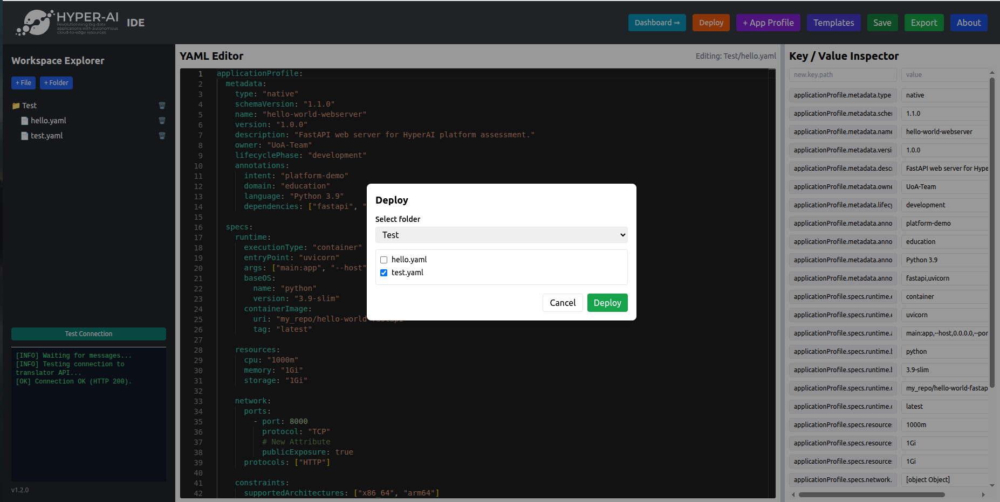
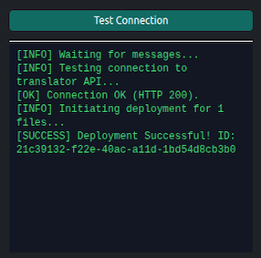

# Quick Start Demo

Deploy your first web server on HyperAI with a few simple steps.

Open the IDE at [ide.hyperai.di.uoa.gr](https://ide.hyperai.di.uoa.gr/) and follow along.

## Step 1 — Create a working directory for your app

You can create a working directory for organizing your app, or group of apps. This is done through the Workspace Explorer by clicking **Create Folder**.



## Step 2 — Create your Application Profile `.yaml`

After creating the working directory, the application profile `.yaml` document must be created. Application profiles contain all the attributes of the app the user wants to run. Again this is done through the Workspace Explorer by clicking **Create File**. Name the file accordingly and add `.yaml` at the end.



## Step 3 — Build the Application Profile

When you are ready to start building the desired Application Profile, click the file in the Workspace Explorer. It opens in the text editor. From there you can:

- edit manually,
- choose a ready-to-play profile from the **Templates**, or
- use the **Application Wizard**.

While editing, remember to save the document before deploying it.

## Step 4 — Use the Wizard

The Wizard offers a series of menus that help build applications for a specific use case easily, without the need to memorize specific attributes and values tied to each use case.



## Step 5 — Navigating the Wizard

1. **Basic Information.** Generic attributes such as the Name of the app, a short description, and the owner's name.
2. **Application Image.** Specify the application image you want to deploy. Make sure you have created an image first before filling this field.
3. **Deployment Profile.** Choose a preset of values — available RAM, CPU cores, GPU and disk storage — tied to a specific use case. Options include **Regular**, **Eco-Friendly**, **AI-Intensive**, and **High Performance**.
4. **Profile Details.** The preset values for the selected Deployment Profile are shown and can be further modified.
5. **Networking.** Set the application's ports and protocols.



## Step 6 — Finalize the Application Profile

After navigating through all the Wizard menus, a new Application Profile is generated with the selected values. Save the newly generated profile or continue editing it through the editor.

## Step 7 — Deployment

When all Application Profiles are ready, click the **Deploy** button. Before this step, make sure each profile has been saved. After clicking the button a window appears for selecting the profiles to deploy — multiple profiles can be deployed at the same time.



## Step 8 — Deployment status

After deployment the Application Profiles are sent to the APM Translator. Watch the console for the status of the deployment. After a successful one, the following message appears:

```text
[SUCCESS] Deployment Successful! ID: 21c30132-f22e-40ac-a11d-1bd54d8cb3b0
```

The ID shown is the specific UUID assigned to this deployment.


