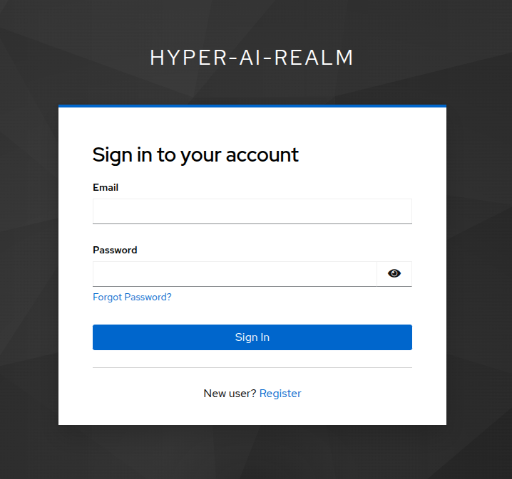
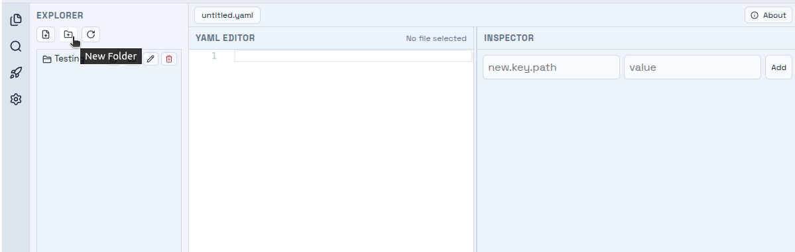
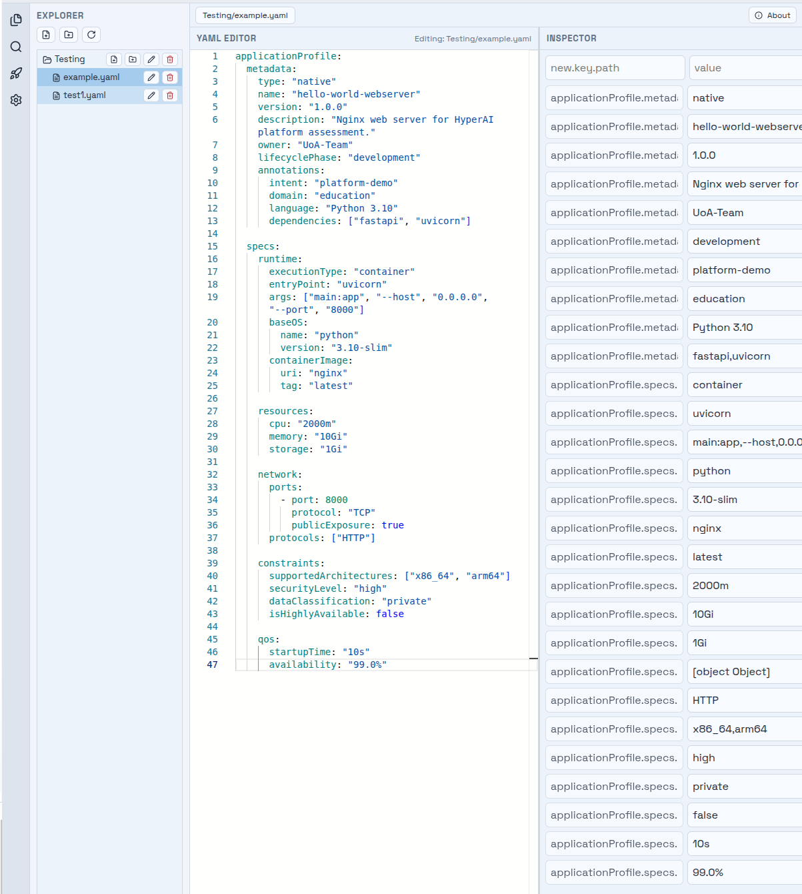
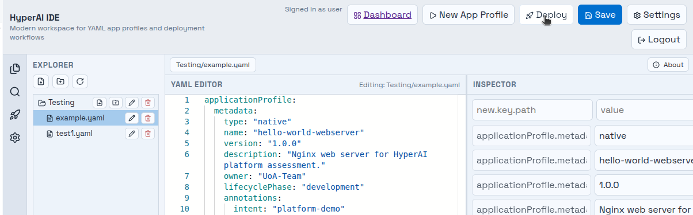
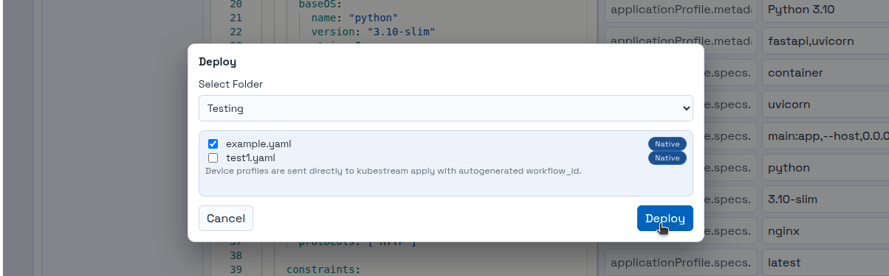
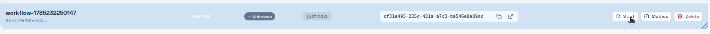
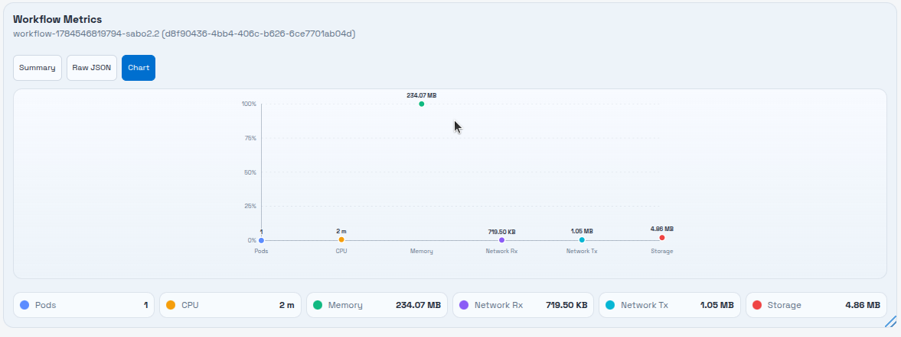

# Quick Start Demo

Deploy your first web server on HyperAI with a few simple steps.

Open the IDE at [ide.hyperai.di.uoa.gr](https://ide.hyperai.di.uoa.gr/) and follow along.

## Step 0 — Publish your image to a whitelisted registry { #step-0 }

Before deploying, your container must live in a **public** registry whitelisted by HyperAI — for example [Docker Hub](https://hub.docker.com/){ target="_blank" rel="noopener" }. You'll reference it in [Step 3](#step-3) when building your Application Profile.

Build the image locally:

```bash
docker build -t <user>/<image>:<tag> .
```

Push it to the registry:

```bash
docker push <user>/<image>:<tag>
```

!!! tip "Further reading"
    Follow the official [Docker Hub quickstart](https://docs.docker.com/docker-hub/quickstart/){ target="_blank" rel="noopener" } for more information.

## Step 1 — Sign in

When you open the IDE you are redirected to the HyperAI sign-in page. Enter your email and password and click **Sign In**.

If you don't have an account yet, click **Register** and create one first.



## Step 2 — Create a working directory for your app

You can create a working directory for organizing your app, or group of apps. This is done through the Workspace Explorer by clicking **Create Folder**.



## Step 3 — Create your Application Profile `.yaml` { #step-3 }

After creating the working directory, the application profile `.yaml` document must be created. Application profiles contain all the attributes of the app the user wants to run. Again this is done through the Workspace Explorer by clicking **Create File**. Name the file accordingly and add `.yaml` at the end.

To build the profile, consult the DSL Specification: [Native Apps](dsl/native-apps.md) for native applications, or [Device Apps](dsl/devices.md) for applications meant to run on a device. You can also find ready-to-use examples in the [Cookbook & Examples](cookbook.md). This is where you reference the container image you pushed in [Step 0](#step-0).



## Step 4 — Deployment

When you are ready, click the **Deploy** button. Before this step, make sure each profile has been saved.



In the popup window, select the workflow you want to deploy and click **Deploy**. Multiple profiles can be deployed at the same time.



You will be asked to manually change the workflow name — if you don't want to, just skip it by clicking **OK**.


## Step 5 — Start your workflows

If you haven't received an error message, click the **Dashboard**. In the list of deployments, find the one you just deployed and press **Start**.



This may take some time until the workflow status is **Running**.

## Tips

If you want to see live analytics of your workflow, click the **Metrics** button.


